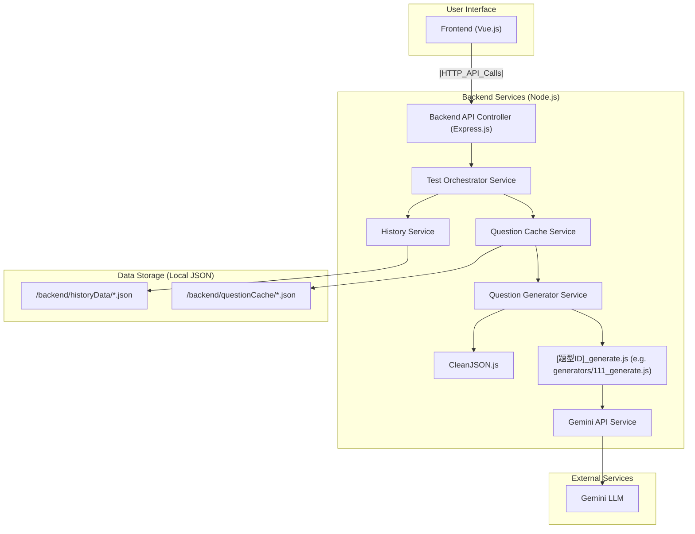
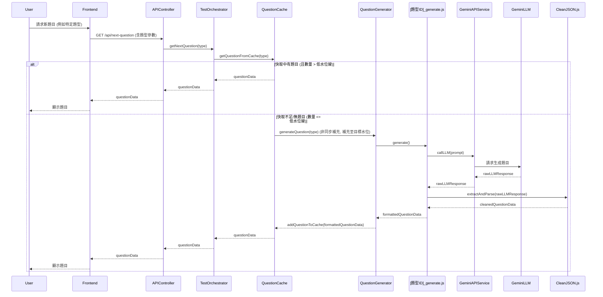

# 開發計劃：LLM 英語學習測驗應用程式 (Read & Write Focus)

## 1. 專案概述

本專案旨在開發一個本地端應用程式（初期為 Web 應用，最終打包為桌面應用），利用大型語言模型 (LLM) 生成針對性的英語閱讀與寫作測驗題。應用程式將允許使用者針對在 `discussion_read&write_2.md` 中定義的特定題型進行反覆練習，或進行包含多種題型的完整測驗。核心目標是提供一個高效、互動的英語自學工具，並透過快取機制優化使用者體驗。

## 2. 技術選型

*   **前端 (Frontend)**: Vue 3 + Vite + TypeScript
*   **後端 (Backend)**: Node.js + Express.js
*   **打包 (Packaging)**: Electron (在 Web 版本功能穩定後進行)
*   **大型語言模型 (LLM)**: Gemini `gemini-2.5-flash-preview-04-17` (根據 `.cursor/rules/project_rule.md` 規定)
*   **API 金鑰管理**: 後端安全處理，例如透過環境變數或安全的本地設定檔（不納入版本控制）。
*   **主要參考文件**: `discussion_read&write_2.md` (定義題型、範例、基礎 JSON 結構)

### 2.1. 核心依賴 (Core Dependencies)

#### 2.1.1. 後端 (Backend - Node.js/Express.js)
*   `express`: Web 應用程式框架。
*   `@google/generative-ai`: 用於與 Google Gemini API 互動的官方 Node.js SDK。
*   `dotenv`: (建議用於本地開發) 用於從 `.env` 檔案載入環境變數，方便管理 API 金鑰等敏感資訊。
*   (其他根據需要，例如 UUID 生成庫 `uuid`)

#### 2.1.2. 前端 (Frontend - Vue 3/Vite/TypeScript)
*   `vue`: Vue.js 核心庫。
*   `vue-router`: Vue.js 的官方路由管理器。
*   `pinia`: (建議) Vue 的官方狀態管理庫。
*   `axios`: (建議) 用於發送 HTTP 請求與後端 API 互動 (或者使用瀏覽器內建的 `fetch` API)。

### 2.2. 開發與測試依賴 (Development & Testing Dependencies)

#### 2.2.1. 後端 (Backend)
*   `nodemon`: (開發依賴) 在開發過程中自動重啟 Node.js 應用程式。
*   `jest`: (測試依賴) JavaScript 測試框架，用於單元測試和整合測試。
*   `supertest`: (測試依賴) 用於測試 HTTP API 端點 (與 Jest 配合使用)。
*   `eslint`: (開發依賴) JavaScript 和 TypeScript 的程式碼檢查工具。
*   `prettier`: (開發依賴) 程式碼格式化工具。
*   `typescript`: (開發依賴) TypeScript 語言本身。
*   `ts-node`: (開發依賴, 如果需要直接執行 TS 腳本) TypeScript 執行引擎。

#### 2.2.2. 前端 (Frontend)
*   `vite`: 前端建構工具。
*   `typescript`: TypeScript 語言本身。
*   `@vitejs/plugin-vue`: Vite 的 Vue 3 插件。
*   `vue-tsc`: (開發依賴) 用於 TypeScript 類型檢查 (通常與 Vite 整合)。
*   `@vue/test-utils`: (測試依賴) Vue Test Utils，用於測試 Vue 組件。
*   `vitest`: (測試依賴, 推薦與 Vite 生態整合) 基於 Vite 的單元測試框架 (可替代 Jest)。
*   `cypress` 或 `playwright`: (測試依賴) 用於端對端 (E2E) 測試 (已在開發流程中提及)。
*   `eslint`: (開發依賴) JavaScript 和 TypeScript 的程式碼檢查工具。
*   `prettier`: (開發依賴) 程式碼格式化工具。

### 2.3. 專案目錄結構

```
project_llm_english_learning_remake/
├── frontend/ (Vue 3 + Vite + TypeScript)
│   ├── public/
│   │   └── ...
│   ├── src/
│   │   ├── assets/                               # 靜態資源 (圖片、字型等)
│   │   ├── components/                           # Vue 組件
│   │   │   ├── QuestionDisplay.vue
│   │   │   ├── AnswerInput.vue
│   │   │   └── ...
│   │   ├── views/                                # Vue 路由頁面組件
│   │   │   ├── TestSelectionView.vue
│   │   │   ├── TestSessionView.vue
│   │   │   └── HistoryView.vue
│   │   ├── router/                               # Vue Router 配置
│   │   ├── store/ (e.g., Pinia)                  # 狀態管理
│   │   ├── services/                             # 前端 API 服務 (與後端溝通)
│   │   └── main.ts                               # Vue 應用入口
│   ├── index.html                              # 主 HTML 檔案
│   ├── vite.config.ts                          # Vite 設定檔
│   ├── tsconfig.json                           # TypeScript 設定檔
│   └── package.json
├── backend/ (Node.js + Express.js)
│   ├── src/
│   │   ├── controllers/                          # API 路由處理器 (APIController.js)
│   │   ├── services/                             # 業務邏輯服務
│   │   │   ├── GeminiAPIService.js
│   │   │   ├── CleanJSON.js
│   │   │   ├── QuestionGeneratorService.js
│   │   │   ├── generators/                       # 各題型生成器模組 (e.g., 111_generate.js)
│   │   │   │   └── 111_generate.js
│   │   │   ├── QuestionCacheService.js
│   │   │   ├── HistoryService.js
│   │   │   └── TestOrchestratorService.js
│   │   ├── routes/                               # Express 路由定義
│   │   ├── utils/                                # 工具函數
│   │   └── server.js (or app.js)                 # Express 應用入口與伺服器啟動
│   ├── questionCache/                          # 題目快取 JSON 檔案
│   │   └── 111Cache.json
│   ├── historyData/                            # 使用者歷史記錄 JSON 檔案
│   └── package.json
├── .cursor/
│   └── rules/
│       ├── project_rule.md
│       └── ...
├── discussion_read&write_2.md
├── devPlanRead&Write.md
├── exam_example.html
└── .gitignore
```
*備註: 此目錄結構為初步規劃，可能隨開發進程調整。根據 `.cursor/rules/project_rule.md` 中的規定，任何結構上的重大調整都應同步更新此處。*

### 2.4. 系統架構與資料流程圖

#### 2.4.1. 系統架構圖



#### 2.4.2. 資料流程圖 (範例：請求新題目)



## 3. 後端架構與核心模組

後端將採用模組化設計，確保職責分離和可維護性。

### 3.1. `GeminiAPIService.js`
*   **職責**: 封裝與 Gemini API 的所有互動。
*   **功能**:
    *   初始化 API 客戶端 (安全處理 API 金鑰)。
    *   向 `gemini-2.5-flash-preview-04-17` 模型發送結構化的請求 (包含 Prompt 和生成配置)。
    *   接收 LLM 的原始回應 (raw response)。
    *   實現統一的 API 錯誤處理和基礎的重試邏輯。
    *   **不負責**解析或清理 LLM 回應中的 JSON 內容，僅傳遞原始回應。

### 3.2. `[題型ID]_generate.js` (例如 `111_generate.js`, `121_generate.js`)
*   **職責**: 針對**單一特定題型**進行題目生成的所有細節處理。
*   **功能**:
    *   **Prompt 設計與構建**: 內部包含或引用為該題型優化的 Prompt 模板（參考 `discussion_read&write_2.md`，包含 few-shot 範例、明確 JSON 輸出格式指示、額外請求鍵如 `explanation_of_Question` 等）。
    *   **LLM 調用**: 調用 `GeminiAPIService.js` 發送 Prompt 以獲取 LLM 的原始回應。
    *   **回應解析與格式化**:
        *   接收來自 `GeminiAPIService.js` 的 LLM 原始回應。
        *   **調用 `CleanJSON.js` 服務**對原始回應進行清理、提取有效的 JSON 字符串，並將其安全地解析為 JavaScript 物件。
        *   驗證 LLM 返回的已清理數據是否符合預期結構和內容。
        *   進行數據清洗和轉換，組裝成前端渲染題目所需的 `questionData` JSON 物件 (包含題目本身、選項、正確答案、前端展示所需的解釋等)。
    *   **錯誤處理**: 處理特定題型生成失敗的邏輯（例如，`CleanJSON.js` 無法解析出有效 JSON），可能觸發重試或返回錯誤標記。

### 3.3. `CleanJSON.js`
*   **職責**: 提供通用的 JSON 清理和安全解析功能，專門處理來自 LLM 的可能不完全規範的原始輸出。
*   **功能**:
    *   `extractAndParse(rawLLMResponse: string): object | null`:
        *   接收 LLM 返回的原始字符串。
        *   嘗試從字符串中提取潛在的 JSON 結構 (例如，處理 Markdown 代碼塊 ```json ... ```，或去除前後不相關的文本)。
        *   對提取出的 JSON 字符串進行初步清理 (例如，嘗試修復常見的 LLM 生成錯誤，如尾隨逗號、不完整的引號等，如果可行且安全的話)。
        *   安全地將清理後的字符串解析為 JavaScript 對象/數組。
        *   如果無法提取或解析出有效的 JSON，則返回 `null` 或拋出特定錯誤。
    *   可能包含其他輔助方法來處理特定格式問題。

### 3.4. `QuestionGeneratorService.js`
*   **職責**: 作為題目生成的統一調度員/協調者。
*   **功能**:
    *   接收通用的題目生成請求 (包含 `questionType` 等參數)。
    *   根據 `questionType` 動態調用相應的 `[題型ID]_generate.js` 模組。
    *   傳遞所需參數給 `[題型ID]_generate.js`。
    *   返回由 `[題型ID]_generate.js` 格式化好的 `questionData`。

### 3.5. `QuestionCacheService.js`
*   **職責**: 管理所有題型的後台快取和緩衝，透過預先獲取和儲存題目，最大限度地減少使用者等待 LLM 生成題目的時間。
*   **核心機制**:
    *   **記憶體快取**: 使用 `Map<questionType, CachedQuestion[]>` 結構在記憶體中儲存各題型已生成的題目陣列。`CachedQuestion` 包含 `id`, `questionData`, `addedAt` 等元數據。
    *   **本地持久化 (可選，但建議)**: 可將記憶體中的快取定期或在應用程式關閉時同步到本地 JSON 檔案 (例如 `/backend/questionCache/[題型ID]Cache.json`)，以便在應用程式重啟時能快速恢復快取狀態。
    *   **緩衝區水位管理**:
        *   **低水位線 (Threshold / Min Questions)**: 為每種題型設定一個最低題目數量閾值（例如，3 題）。當該題型的快取題目數量**低於或等於**此閾值時，會觸發背景補充機制。
        *   **目標水位線 (Target Quota / Max Questions)**: 為每種題型設定一個目標快取題目數量（例如，8-10 題）。背景補充機制會嘗試生成題目，直到快取中的題目數量達到此目標。
*   **功能**:
    *   **初始化與載入**: 應用啟動時，可從本地持久化檔案（如果實現了）載入快取。檢查各題型快取是否低於目標水位線，如果是，則觸發初次填充。
    *   **提供題目 (`getQuestionFromCache(questionType)`)**:
        *   當接收到題目請求時，首先檢查對應題型的記憶體快取。
        *   如果快取中有題目，則取出並返回一道題目。
        *   從快取中移除題目後，**立即檢查**該題型剩餘題目數量是否已降至低水位線以下。如果是，則**非同步觸發**背景補充任務 `_triggerReplenishment(questionType)`。
        *   如果快取中無可用題目，則可能需要等待正在進行的補充任務完成，或直接觸發一次即時生成（需考量使用者體驗）。
    *   **背景補充任務 (`_triggerReplenishment(questionType)`)**:
        *   此為非同步操作，不應阻塞主線程或使用者請求。
        *   調用 `QuestionGeneratorService.js` 為指定題型生成新題目，直到快取中的題目數量達到目標水位線。
        *   需要有效處理併發調用，避免對同一題型重複觸發過多補充任務（例如，使用鎖或標記正在補充的狀態）。
        *   新生成的題目加入到記憶體快取，並更新本地持久化檔案（如果實現了）。
    *   **持久化管理**: 如果實現了本地持久化，需確保對記憶體快取的修改（新增、移除題目）能可靠地同步到本地 JSON 檔案。

### 3.6. `HistoryService.js`
*   **職責**: 管理使用者答題歷史。
*   **儲存方式**: 初期使用 **JSON 檔案**儲存。檔案結構可按日期或測驗會話組織。
*   **記錄資訊 (每條記錄)**:
    *   `questionData`: 完整的題目內容 (包含題目文本、選項、**正確答案**、**LLM 生成的解釋**等前端展示和後續分析所需資訊)。
    *   `userAnswer`: 使用者提交的答案。
    *   `isCorrect`: 布林值，表示答案是否正確 (由後端判斷)。
    *   `timestamp`: 作答時間戳。
    *   *(其他如 `recordId`, `userId`, `sessionId`, `testItem`, `questionType`, `duration`, `difficultyLevel`, `userFeedback` 暫不納入)*
*   **功能**:
    *   提供儲存作答記錄到 JSON 檔案的函數。
    *   提供從 JSON 檔案檢索歷史紀錄的函數。

### 3.7. `TestOrchestratorService.js`
*   **職責**: 測驗流程的總指揮和協調者。
*   **功能**:
    *   **管理測驗會話**: 初始化和追蹤當前測驗狀態。
    *   **決定測驗內容與流程**:
        *   處理單一題型練習請求 (決定題目數量，循環獲取題目)。
        *   處理完整測驗請求 (根據策略決定題型組合和順序)。
    *   **題目獲取協調**: 調用 `QuestionCacheService.js` 獲取題目。
    *   **答案提交與結果處理協調**:
        *   接收使用者答案。
        *   調用評分邏輯判斷答案正確性。
        *   調用 `HistoryService.js` 記錄結果。
        *   決定下一步是提供下一題還是結束測驗。

### 3.8. API Endpoints and Controller (`APIController.js`)
*   **職責**: 定義和處理前端的 HTTP API 請求，作為前後端通訊的橋樑。這些端點構成初步的 API 合約，可在開發過程中迭代和擴展。
*   **主要端點 (示例)**:
    *   `GET /api/question-types`: 獲取可用題型列表 (可從 `discussion_read&write_2.md` 解析或配置中讀取)。
    *   `POST /api/start-test`: (body: `{ testMode: 'single' | 'full', questionType?: '1.1.1', config?: {...} }`) 開始測驗。
    *   `GET /api/next-question`: (session/test ID) 獲取下一題。
    *   `POST /api/submit-answer`: (body: `{ questionDataSnapshot: {...}, userAnswer: '...', timestamp: ... }`) 提交答案。
    *   `GET /api/history`: (query params: `date`, `testType`) 獲取歷史記錄。

## 4. 前端 (Vue 3 + Vite + TypeScript)

*   **職責**:
    *   根據後端提供的數據渲染使用者介面（題目、選項、作答區域、歷史記錄等）。
    *   處理使用者輸入和交互事件。
    *   向後端 API 發送請求 (獲取題目、提交答案、請求歷史等)。
    *   嚴格遵守「瘦客戶端」原則：不負責複雜的業務邏輯、數據快取或大量的狀態管理，這些都由後端處理。
*   **核心組件 (可能)**:
    *   `TestSelectionView.vue`: 選擇測驗模式和題型。
    *   `QuestionDisplay.vue`: 根據不同 `questionType` 和 `questionData` 渲染題目。
    *   `AnswerInput.vue`: 根據題型提供不同的作答界面 (單選、文本輸入等)。
    *   `TestSessionView.vue`: 管理進行中的測驗流程。
    *   `HistoryView.vue`: 展示歷史作答記錄。

## 5. 核心功能

*   **基於 LLM 的題目生成**: 根據 `discussion_read&write_2.md` 中定義的題型動態生成題目。
*   **單一題型反覆練習**: 使用者可選擇特定題型進行集中練習。
*   **完整測驗模式**: 提供包含多種題型的綜合測驗。
*   **後台題目快取**: 自動在後台預加載題目，減少使用者等待時間。
*   **作答歷史追蹤與展示**: 記錄使用者作答情況。
*   **(未來) 難度調整**: LLM 根據使用者歷史表現調整後續出題難度 (Prompt 細節待議)。

## 6. 開發流程與迭代建議

1.  **環境搭建**: 完成 Node.js, Express, Vue 3, Vite, TypeScript 基礎專案結構。
2.  **API 金鑰配置與安全**: 確立並實施 API 金鑰的安全管理方案。
3.  **後端核心服務實現 (迭代進行與測試驅動)**:
    *   **階段一: 基礎服務與單元測試**
        *   `GeminiAPIService.js`: 確保能與 `gemini-2.5-flash-preview-04-17` 成功通訊。**撰寫單元測試**模擬 API 呼叫與回應處理。
        *   `CleanJSON.js`: 實現基礎的 JSON 清理與解析。**撰寫單元測試**驗證各種字串輸入的處理。
    *   **階段二: 單一題型端到端 (例如 1.1.1) 與整合測試**
        *   `111_generate.js`: 精心設計 Prompt (包含 `explanation_of_Question` 生成)，實現題目生成、解析與格式化。**撰寫單元測試**驗證 Prompt 生成邏輯和回應解析。
        *   `QuestionGeneratorService.js`: 實現對 `111_generate.js` 的調用。**撰寫單元測試**。
        *   `QuestionCacheService.js`: 實現對 1.1.1 題型的快取邏輯 (記憶體與本地 JSON)。**撰寫單元測試**驗證快取命中、未命中、補充、持久化邏輯。
        *   `HistoryService.js`: 實現對 1.1.1 題型作答的歷史記錄 (JSON 存檔)。**撰寫單元測試**驗證記錄的儲存和讀取。
        *   `TestOrchestratorService.js`: 實現單一題型 (1.1.1) 的練習流程。**撰寫單元測試**。
        *   基礎的 API 端點 (`APIController.js`) 供後續測試。**撰寫整合測試**測試從 API 請求到 `TestOrchestratorService` 獲取題目並記錄歷史的完整流程。
    *   **階段三: 前端對接、擴展與自動化端對端測試**
        *   開發前端頁面以展示和測試 1.1.1 題型的生成與作答。
        *   逐步為 `discussion_read&write_2.md` 中的其他題型實現對應的 `[題型ID]_generate.js` 及相關服務的擴展，並**為每個模組補充單元測試和整合測試**。
        *   引入**自動化端對端 (E2E) 測試框架** (例如 Cypress 或 Playwright) 針對核心使用者場景（如選擇題型、答題、查看歷史）編寫測試腳本。
4.  **完整測驗模式開發與測試**:
    *   在 `TestOrchestratorService.js` 中實現完整測驗的題型組合與流程控制邏輯。**撰寫相應的單元與整合測試**。
    *   前端支持完整測驗模式，並**擴展 E2E 測試**覆蓋此模式。
5.  **UI/UX 優化、全面測試與持續整合**:
    *   完善使用者介面和交互體驗。
    *   進行全面的功能測試、效能測試和錯誤修復。
    *   **建立持續整合 (CI)流程**: 每當程式碼提交時自動運行所有測試 (單元、整合、E2E)。
6.  **Electron 打包**: 在 Web 版本功能穩定且通過所有測試後，將應用打包為桌面程式。

## 7. 待後續詳細討論的點 (開發過程中)

*   **各題型 `[題型ID]_generate.js` 中具体的 Prompt 設計細節**:
    *   Few-shot 範例的選擇與優化。
    *   針對 LLM 輸出不穩定性的調整策略 (例如，輸出格式驗證、重試機制、備用 Prompt)。
    *   難度控制的 Prompt 設計方法與歷史數據的結合方式。
    *   如何確保 LLM 生成的 `explanation_of_Question` 或其他輔助資訊的品質和相關性。
*   **各題型 `questionData` 在 `HistoryService.js` 中儲存的具體 JSON 結構細節**:
    *   確保包含所有必要的回顧、分析以及未來潛在功能（如錯題重練、進度追蹤）所需的資訊。
    *   考慮數據冗余與正規化之間的平衡。
*   **歷史記錄 JSON 檔案的具體組織方式**:
    *   單一檔案 vs. 按日期/使用者/測驗會話分割。
    *   檔案命名約定和目錄結構。
    *   大型歷史數據的查詢效率考量。
*   **完整測驗模式下，題型組合的具體策略和配置方式**:
    *   固定組合 vs. 可配置組合 vs. 基於使用者表現的動態組合。
    *   每種題型的數量和順序。
*   **API 端點的詳細請求/回應格式與驗證**:
    *   所有 API 端點的參數、請求體、回應體的詳細規格。
    *   輸入驗證規則 (例如，使用 Joi 或 Zod)。
*   **錯誤處理和日誌記錄的具體策略**:
    *   統一的錯誤碼和錯誤訊息格式。
    *   日誌級別 (debug, info, warn, error)。
    *   敏感資訊的脫敏處理。
    *   日誌的儲存與查閱方案。
*   **自動化測試策略細化**:
    *   **單元測試**: 各模組/函數的覆蓋率目標。模擬 (mocking) 外部依賴 (如 LLM API, 文件系統) 的策略。
    *   **整合測試**: 關鍵服務之間互動的測試場景。測試資料庫/文件系統互動的正確性。
    *   **端對端 (E2E) 測試**: 核心使用者流程的自動化。測試環境的準備與清理。
    *   **測試數據管理**: 如何準備和管理各類測試所需的數據。
*   **前端狀態管理策略**: 雖然是瘦客戶端，但仍需決定簡單的客戶端狀態管理方案 (例如 Pinia)。
*   **安全性考量**:
    *   除了 API 金鑰，是否有其他潛在安全風險點 (例如，輸入清理防止注入)。
    *   Electron 打包時的安全性配置。
*   **快取更新與失效策略**: `QuestionCacheService.js` 中快取資料的更新頻率、失效條件（例如，當 `discussion_read&write_2.md` 更新時，是否需要清空或更新快取）。

本文檔將作為後續開發的主要參考依據，並可根據開發進程和需求變化進行更新。 