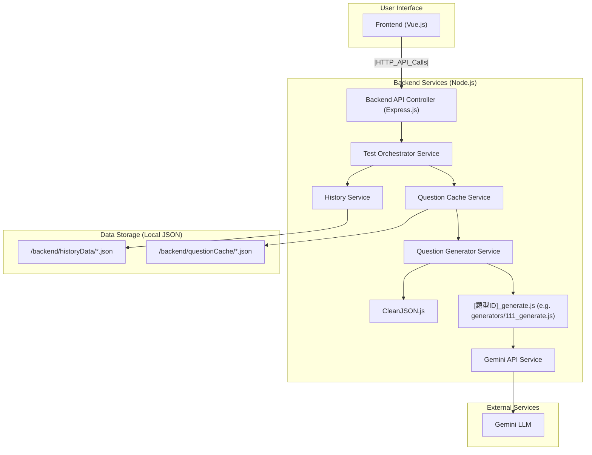
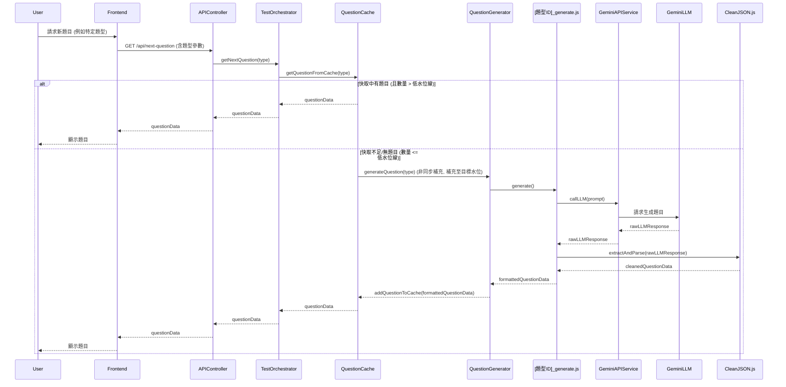

# 開發計劃：LLM 英語學習測驗應用程式 (Read & Write Focus)

## 1. 專案概述

本專案旨在開發一個本地端應用程式（初期為 Web 應用，最終打包為桌面應用），利用大型語言模型 (LLM) 生成針對性的英語閱讀與寫作測驗題。應用程式將允許使用者針對在 `discussion_read&write.md` 中定義的特定題型進行反覆練習，或進行包含多種題型的完整測驗。核心目標是提供一個高效、互動的英語自學工具，並透過快取機制優化使用者體驗。

## 2. 技術選型

*   **前端 (Frontend)**: Vue 3 + Vite + TypeScript
*   **後端 (Backend)**: Node.js + Express.js
*   **打包 (Packaging)**: Electron (在 Web 版本功能穩定後進行)
*   **大型語言模型 (LLM)**: Gemini `gemini-2.5-flash-preview-04-17` (根據 `.cursor/rules/project_rule.md` 規定)
*   **API 金鑰管理**: 後端安全處理，例如透過環境變數或安全的本地設定檔（不納入版本控制）。
*   **主要參考文件**: `discussion_read&write.md` (定義題型、範例、基礎 JSON 結構)

### 2.1. 核心依賴 (Core Dependencies)

#### 2.1.1. 後端 (Backend - Node.js/Express.js)
*   `express`: Web 應用程式框架。
*   `@google/generative-ai`: 用於與 Google Gemini API 互動的官方 Node.js SDK。
*   `dotenv`: (建議用於本地開發) 用於從 `.env` 檔案載入環境變數，方便管理 API 金鑰等敏感資訊。
*   (其他根據需要，例如 UUID 生成庫 `uuid`)

#### 2.1.2. 前端 (Frontend - Vue 3/Vite/TypeScript)
*   `vue`: Vue.js 核心庫。
*   `vue-router`: Vue.js 的官方路由管理器。
*   `pinia`: (建議) Vue 的官方狀態管理庫。
*   `axios`: (建議) 用於發送 HTTP 請求與後端 API 互動 (或者使用瀏覽器內建的 `fetch` API)。

### 2.2. 開發與測試依賴 (Development & Testing Dependencies)

#### 2.2.1. 後端 (Backend)
*   `nodemon`: (開發依賴) 在開發過程中自動重啟 Node.js 應用程式。
*   `jest`: (測試依賴) JavaScript 測試框架，用於單元測試和整合測試。
*   `ts-jest`: (測試依賴) Jest 的 TypeScript preprocessor，允許使用 Jest 測試 TypeScript 程式碼。
*   `supertest`: (測試依賴) 用於測試 HTTP API 端點 (與 Jest 配合使用)。
*   `eslint`: (開發依賴) JavaScript 和 TypeScript 的程式碼檢查工具。
*   `prettier`: (開發依賴) 程式碼格式化工具。
*   `typescript`: (開發依賴) TypeScript 語言本身。
*   `@types/node`: (開發依賴) Node.js 的 TypeScript 類型定義。
*   `@types/express`: (開發依賴) Express.js 的 TypeScript 類型定義。
*   `@types/jest`: (開發依賴) Jest 的 TypeScript 類型定義。
*   `ts-node`: (開發依賴, 如果需要直接執行 TS 腳本) TypeScript 執行引擎。

#### 2.2.2. 前端 (Frontend)
*   `vite`: 前端建構工具。
*   `typescript`: TypeScript 語言本身。
*   `@vitejs/plugin-vue`: Vite 的 Vue 3 插件。
*   `vue-tsc`: (開發依賴) 用於 TypeScript 類型檢查 (通常與 Vite 整合)。
*   `@vue/test-utils`: (測試依賴) Vue Test Utils，用於測試 Vue 組件。
*   `vitest`: (測試依賴, 推薦與 Vite 生態整合) 基於 Vite 的單元測試框架 (可替代 Jest)。
*   `cypress` 或 `playwright`: (測試依賴) 用於端對端 (E2E) 測試 (已在開發流程中提及)。
*   `eslint`: (開發依賴) JavaScript 和 TypeScript 的程式碼檢查工具。
*   `prettier`: (開發依賴) 程式碼格式化工具。

### 2.3. 專案目錄結構

```
project_llm_english_learning_remake/
├── frontend/ (Vue 3 + Vite + TypeScript)
│   ├── public/
│   │   └── ...
│   ├── src/
│   │   ├── assets/                               # 靜態資源 (圖片、字型等)
│   │   ├── components/                           # Vue 組件
│   │   │   ├── QuestionDisplay.vue
│   │   │   ├── AnswerInput.vue
│   │   │   └── ...
│   │   ├── views/                                # Vue 路由頁面組件
│   │   │   ├── TestSelectionView.vue
│   │   │   ├── TestSessionView.vue
│   │   │   └── HistoryView.vue
│   │   ├── router/                               # Vue Router 配置
│   │   ├── store/ (e.g., Pinia)                  # 狀態管理
│   │   ├── services/                             # 前端 API 服務 (與後端溝通)
│   │   └── main.ts                               # Vue 應用入口
│   ├── index.html                              # 主 HTML 檔案
│   ├── vite.config.ts                          # Vite 設定檔
│   ├── tsconfig.json                           # TypeScript 設定檔
│   └── package.json
├── backend/ (Node.js + Express.js)
│   ├── src/
│   │   ├── controllers/                          # API 路由處理器 (APIController.js)
│   │   ├── services/                             # 業務邏輯服務
│   │   │   ├── GeminiAPIService.js
│   │   │   ├── CleanJSON.js
│   │   │   ├── QuestionGeneratorService.js
│   │   │   ├── generators/                       # 各題型生成器模組 (e.g., 111_generate.js)
│   │   │   │   └── 111_generate.js
│   │   │   ├── QuestionCacheService.js
│   │   │   ├── HistoryService.js
│   │   │   └── TestOrchestratorService.js
│   │   ├── utils/                                # 工具函數
│   │   │   └── LLMConfigService.ts               # LLM 參數配置服務
│   │   └── server.js (or app.js)                 # Express 應用入口與伺服器啟動
│   ├── questionCache/                          # 題目快取 JSON 檔案
│   │   └── 111Cache.json
│   ├── historyData/                            # 使用者歷史記錄 JSON 檔案 (例如 history111.json, history121.json)
│   ├── GeneratorConfig.json                    # 不同題型生成器的 LLM 參數配置文件
│   └── package.json
├── .cursor/
│   └── rules/
│       ├── project_rule.md
│       └── ...
├── discussion_read&write.md
├── devPlanRead_Write.md
├── exam_example.html
└── .gitignore
```
*備註: 此目錄結構為初步規劃，可能隨開發進程調整。根據 `.cursor/rules/project_rule.md` 中的規定，任何結構上的重大調整都應同步更新此處。*

### 2.4. 系統架構與資料流程圖

#### 2.4.1. 系統架構圖



#### 2.4.2. 資料流程圖 (範例：請求新題目)



## 3. 後端架構與核心模組

後端將採用模組化設計，確保職責分離和可維護性。

### 3.1. `GeminiAPIService.js`
*   **職責**: 封裝與 Gemini API 的所有互動。
*   **主要功能**:
    *   初始化 Gemini API 客戶端 (使用 API Key)。
    *   提供一個方法 (例如 `async getResponse(prompt: string, options?: { responseSchema?: any, config?: any }): Promise<string | object | any[]>`)，接收 prompt、可選的回應 schema 以及 LLM 配置參數 (如 `temperature`, `thinkingBudget`)，並返回 LLM 的原始回應或解析後的 JSON。
    *   錯誤處理 (API 呼叫失敗、超時等)。
    *   API 金鑰管理：服務啟動時，透過 `dotenv` 從 `.env` 檔案 (位於 `/Users/wu_cheng_yan/cursor/project_llm_english_learning_remake/llm_english_learning_read_write/backend/.env`，並已加入 `.gitignore`) 加載 `GEMINI_API_KEY`。確保金鑰不被硬編碼或提交到版本控制。
*   **單元測試**: 模擬 `@google/generative-ai` SDK，測試成功、失敗及 API Key 未配置等情況。

### 3.2. `CleanJSON.js`
*   **職責**: 清理和解析來自 LLM 的可能不完美的 JSON 回應。
*   **主要功能**:
    *   接收 LLM 返回的原始字串。
    *   提取被 Markdown ```json ... ``` 包裹的 JSON 內容。
    *   嘗試修復常見的 LLM JSON 輸出瑕疵 (例如，移除尾隨逗號 - 可選，需謹慎處理)。
    *   安全地解析 JSON 字串 (使用 `try-catch`)。
    *   返回解析後的 JavaScript 物件，或在失敗時返回 `null`。
*   **單元測試**: 測試各種輸入情況 (標準 JSON, Markdown 包裹, 帶瑕疵 JSON, 無效 JSON, 空輸入等)。

### 3.3. `[題型ID]_generate.js` (例如 `generators/111_generate.js`)
*   **職責**: 為特定題型生成題目數據。
*   **主要功能 (每個題型一個模組)**:
    *   包含該題型專用的 Prompt 模板 (可能從外部文件讀取)。
    *   調用 `GeminiAPIService.js` 獲取 LLM 回應，可傳遞從 `LLMConfigService.ts` 獲取的特定 LLM 參數 (如 `temperature`, `thinkingBudget`)。
    *   調用 `CleanJSON.js` 解析回應。
    *   驗證和格式化解析後的數據，確保符合該題型所需的結構 (參考 `discussion_read&write.md` 中的 JSON 結構定義)。
    *   返回格式化後的題目物件，或在失敗時返回 `null`。
*   **單元測試**: 模擬 `GeminiAPIService` 和 `CleanJSON`，測試題目生成成功與失敗的情況。

### 3.4. `QuestionGeneratorService.js`
*   **職責**: 調度不同題型的題目生成器。
*   **主要功能**:
    *   提供一個方法 (例如 `async generateQuestionByType(questionType: string): Promise<object | null>`)。
    *   根據傳入的 `questionType`，調用對應的 `[題型ID]_generate.js` 模組。
    *   處理未知題型的情況。
*   **單元測試**: 模擬各 `[題型ID]_generate.js` 模組，測試能否正確調度。

### 3.5. `QuestionCacheService.js`
*   **職責**: 管理題目快取 (記憶體 + 本地 JSON 檔案)。
*   **主要功能**:
    *   為**每個題型**維護一個獨立的記憶體快取 (例如 `Map<string, CacheEntry[]>`) 和一個對應的本地 JSON 快取檔案 (例如 `/Users/wu_cheng_yan/cursor/project_llm_english_learning_remake/llm_english_learning_read_write/backend/questionCache/111Cache.json`)。
    *   **CacheEntry 結構**: `{ UUID: string, questionData: object, cacheTimestamp: number }`
    *   **初始化**: 應用啟動時，從本地 JSON 檔案載入快取到記憶體。
    *   **提供題目**: 從記憶體快取中獲取題目 (FIFO)。
    *   **水位管理**: 為每個題型定義低水位線 (例如 `LOW_WATER_MARK = 4`) 和目標水位線 (例如 `TARGET_FILL_COUNT = 8`)。
    *   **背景補充**: 當某題型的快取數量低於低水位線時，非同步觸發背景任務，調用 `QuestionGeneratorService` 生成新題目，直到達到目標水位線。
        *   **重試機制**: 題目生成失敗時，實現最多3次的指數退避重試。
    *   **持久化**: 每當記憶體快取更新 (新增或移除題目)，將對應題型的快取完整地異步寫回其本地 JSON 檔案。
*   **單元測試**: 模擬 `QuestionGeneratorService` 和檔案系統操作，測試快取載入、提供、補充、持久化及重試邏輯。

### 3.6. `HistoryService.js`
*   **職責**: 儲存和檢索使用者作答歷史。
*   **主要功能**:
    *   為**每個題型**管理一個獨立的歷史記錄 JSON 檔案 (例如 `/Users/wu_cheng_yan/cursor/project_llm_english_learning_remake/llm_english_learning_read_write/backend/historyData/history111.json`)。
    *   **記錄資訊 (每條記錄 `HistoryEntry`)**:
        ```json
        {
            "UUID": "c9dbc356-95db-427e-945a-be379550bce3", // 題目的 UUID (來自題目快取或外部傳入)
            "questionData": { // 作答時的題目完整快照 (包含題目、選項、正確答案等)
                 // ... 結構同 QuestionCacheService 中的 questionData ...
            },
            "userAnswer": "C", // 使用者提交的答案 (例如選項字母，或寫作題的文本)
            "isCorrect": true, // 後端判斷答案是否正確 (對於選擇題)
            "timestamp": 1678886400000 // 作答完成的時間戳 Unix timeStamp
        }
        ```
    *   **儲存記錄**: 將新的歷史記錄追加到對應題型歷史檔案的陣列開頭。
    *   **檢索記錄**: 提供按題型檢索歷史記錄的功能 (未來可支持分頁)。
*   **單元測試**: 模擬檔案系統操作，測試歷史記錄的儲存和檢索。

### 3.7. `TestOrchestratorService.js`
*   **職責**: 協調單一題型練習的完整流程。
*   **主要功能**:
    *   **開始練習 (`startSingleTypeTest(questionType)`)**: 從 `QuestionCacheService` 獲取第一題。
    *   **提交答案 (`submitAnswer(questionId, userAnswer, originalQuestionData)`)**:
        *   判斷答案正確性 (對於選擇題)。
        *   調用 `HistoryService` 記錄作答歷史。
        *   從 `QuestionCacheService` 獲取下一題。
        *   返回作答結果和下一題。
*   **單元測試**: 模擬 `QuestionCacheService` 和 `HistoryService`，測試練習流程的各個環節。

### 3.8. `LLMConfigService.ts` (位於 `utils/` 目錄)
*   **職責**: 管理和提供不同題型生成器所需的 LLM 參數配置。
*   **主要功能**:
    *   從 `GeneratorConfig.json` 檔案載入 LLM 參數配置。
    *   提供方法 (例如 `getConfig(questionType: string): { temperature?: number, thinkingBudget?: number, ... }`)，根據題型 ID 返回對應的 LLM 參數。
    *   提供預設參數，以防某些題型未在配置文件中明確指定。
    *   處理配置文件讀取或解析錯誤。
*   **單元測試**: 模擬檔案系統操作，測試配置載入、提供及錯誤處理邏輯。

### 3.9. `APIController.js` (位於 `controllers/` 目錄)
*   **職責**: 處理來自前端的 HTTP 請求，調用相應的服務並返回回應。
*   **主要端點 (參考 `discussion_read&write.md` API 設計)**:
    *   `GET /api/question-types`: 返回支持的題型列表。
    *   `POST /api/start-test`: 開始一個指定題型的測驗 (調用 `TestOrchestratorService.startSingleTypeTest`)。
    *   `POST /api/submit-answer`: 提交答案並獲取下一題 (調用 `TestOrchestratorService.submitAnswer`)。
    *   `GET /api/history?questionType={type}`: 獲取指定題型的歷史記錄 (調用 `HistoryService.getHistory`)。
*   **整合測試**: 使用 `supertest` 測試 API 端點的行為，模擬底層服務。

### 3.10. `server.js` (或 `app.js`)
*   **職責**: 初始化 Express 應用，設定中介軟體 (如 `express.json()`)，註冊 API 路由，啟動 HTTP 伺服器。

## 4. 前端架構與核心組件 (Vue 3 + TypeScript)

前端將採用組件化架構，實現使用者介面和互動邏輯。

### 4.1. `main.ts`
*   Vue 應用程式的入口點，初始化 Vue 實例、Vue Router 和 Pinia (如果使用)。

### 4.2. `router/index.ts`
*   定義應用程式的路由規則，將 URL 路徑映射到對應的視圖組件。
*   主要路由:
    *   `/`: 測驗選擇頁面 (`TestSelectionView.vue`)
    *   `/test/:questionType`: 測驗進行中頁面 (`TestSessionView.vue`)
    *   `/history`: 歷史記錄查看頁面 (`HistoryView.vue`)

### 4.3. `store/index.ts` (例如使用 Pinia)
*   管理應用程式的全局狀態，例如：
    *   當前測驗的題型。
    *   當前題目數據。
    *   使用者答案。
    *   測驗統計 (例如答對題數)。
    *   載入狀態 (例如正在從後端獲取題目)。

### 4.4. `services/apiService.ts`
*   封裝與後端 API 的所有通訊邏輯。
*   提供方法來調用後端的各個端點 (例如 `getQuestionTypes()`, `startTest(questionType)`, `submitAnswer(payload)`, `getHistory(questionType)`)。
*   使用 `axios` 或 `fetch` API。

### 4.5. `views/` 目錄 (主要頁面組件)
*   **`TestSelectionView.vue`**: 測驗選擇頁面。
    *   從後端獲取並顯示可用的題型列表 (`GET /api/question-types`)。
    *   允許使用者選擇一個題型開始測驗。
    *   選擇後，導航到 `/test/:questionType`。
*   **`TestSessionView.vue`**: 測驗進行中頁面。
    *   根據路由參數 `:questionType`，調用後端 `POST /api/start-test` 開始測驗並獲取第一題。
    *   使用 `QuestionDisplay.vue` 顯示題目。
    *   使用 `AnswerInput.vue` 讓使用者輸入答案。
    *   提交答案後 (`POST /api/submit-answer`)，顯示作答結果 (是否正確、正確答案、解釋)，然後載入下一題。
    *   處理題目載入中、測驗結束等狀態。
*   **`HistoryView.vue`**: 歷史記錄查看頁面。
    *   允許選擇題型 1.1.1。
    *   調用 API 獲取並顯示其歷史記錄。

### 4.6. `components/` 目錄 (可複用組件)
*   **`QuestionDisplay.vue`**: 負責渲染題目內容。
    *   接收題目數據物件作為 prop。
    *   根據題目數據的結構 (例如 `passageOrPrompt`, `question`, `options` 等) 以適當的方式展示。
    *   需要能適應不同題型的展示需求 (例如選擇題選項、閱讀段落、寫作提示等)。
*   **`AnswerInput.vue`**: 負責處理使用者答案的輸入。
    *   接收題型作為 prop，以決定輸入方式 (例如選擇題的單選按鈕、寫作題的文本框)。
    *   將使用者輸入的答案通過事件發送回父組件 (`TestSessionView.vue`)。
*   **`LoadingSpinner.vue`**: 通用的載入指示器。
*   **`ErrorMessage.vue`**: 通用的錯誤訊息顯示組件。

## 5. `discussion_read&write.md` 的核心整合點

*   **題型定義**: `discussion_read&write.md` 是所有題型及其變體的權威來源。後端 `[題型ID]_generate.js` 模組的 Prompt 設計和期望的 JSON 輸出結構，以及前端 `QuestionDisplay.vue` 和 `AnswerInput.vue` 的渲染邏輯，都必須嚴格遵循此文件中的定義。
*   **JSON 結構**: `discussion_read&write.md` 為每個題型範例提供了 JSON 結構。這些結構是前後端數據交換的契約。
    *   後端 `CleanJSON.js` 和各 `[題型ID]_generate.js` 需確保輸出符合此結構。
    *   前端組件需能解析並渲染此結構。
*   **Prompt 模板**: 雖然 `discussion_read&write.md` 提供了初步的 Prompt 示例，但每個 `[題型ID]_generate.js` 中會包含針對該題型優化的、更詳細的 Prompt 模板。開發過程中可能需要反覆調整這些 Prompt 以獲得最佳的題目生成質量。

## 6. 開發階段與順序

開發將分階段進行，優先完成核心後端服務和一個完整題型的端到端流程，然後逐步擴展。

### 6.1. **階段一：後端基礎建設 (約 2-3 天)** `devBackendPhase1.md`
    1.  **專案初始化與環境配置**: (`devBackendPhase1.md` - Phase1.1)
        *   初始化 Node.js 專案 (`/Users/wu_cheng_yan/cursor/project_llm_english_learning_remake/llm_english_learning_read_write/backend/`)。
        *   安裝 Express, TypeScript 及相關開發、測試依賴。
        *   配置 `tsconfig.json`, ESLint, Prettier, Nodemon, Jest (`jest.config.js`)。
        *   建立 `backend/src/` 下的服務、控制器、路由、工具等目錄結構。
    2.  **`GeminiAPIService.js` 實現與測試**: (`devBackendPhase1.md` - Phase1.2)
        *   實現 API 金鑰管理 (使用 `.env`，路徑 `/Users/wu_cheng_yan/cursor/project_llm_english_learning_remake/llm_english_learning_read_write/backend/.env`)。
        *   實現與 Gemini API 通訊的核心函數。
        *   編寫單元測試。
    3.  **`CleanJSON.js` 實現與測試**: (`devBackendPhase1.md` - Phase1.3)
        *   實現 JSON 提取與清理邏輯。
        *   編寫單元測試。
    4.  **`package.json` 更新**: (`devBackendPhase1.md` - Phase1.4)

### 6.2. **階段二：單一題型 (1.1.1) 後端實現 (約 3-4 天)**
    涵蓋 `devBackendPhase2.md` 到 `devBackendPhase5.md` 的內容，目標是完整實現題型 `1.1.1` (詞義選擇) 的後端支持和 API。

    1.  **`111_generate.js` 實現與測試**: (`devBackendPhase2.md` - Phase2.1, Phase2.2)
        *   設計並實現題型 1.1.1 的 Prompt 模板和生成邏輯 (位於 `/Users/wu_cheng_yan/cursor/project_llm_english_learning_remake/llm_english_learning_read_write/backend/src/services/generators/111_generate.js`)。
        *   編寫單元測試。
    2.  **`QuestionGeneratorService.js` 初步實現與測試**: (`devBackendPhase2.md` - Phase2.3, Phase2.4)
        *   實現調度 `111_generate.js` 的邏輯。
        *   編寫單元測試。
    3.  **`QuestionCacheService.js` 實現與測試 (針對題型 1.1.1)**: (`devBackendPhase3.md`)
        *   實現記憶體快取、本地 JSON 持久化 (`/Users/wu_cheng_yan/cursor/project_llm_english_learning_remake/llm_english_learning_read_write/backend/questionCache/111Cache.json`)、水位管理、背景補充及重試機制。
        *   編寫單元測試。
    4.  **`HistoryService.js` 實現與測試 (針對題型 1.1.1)**: (`devBackendPhase4.md`)
        *   實現歷史記錄的儲存 (`/Users/wu_cheng_yan/cursor/project_llm_english_learning_remake/llm_english_learning_read_write/backend/historyData/history111.json`) 和讀取。
        *   編寫單元測試。
    5.  **`TestOrchestratorService.js` 實現與測試 (針對題型 1.1.1)**: (`devBackendPhase5.md` - Phase5.1, Phase5.2)
        *   協調獲取題目、處理答案、記錄歷史的流程。
        *   編寫單元測試。
    6.  **API 端點 (`APIController.js`, `server.js`) 初步實現與整合測試**: (`devBackendPhase5.md` - Phase5.3, Phase5.4)
        *   實現 `/api/question-types`, `/api/start-test`, `/api/submit-answer`, `/api/history` 端點。
        *   編寫針對題型 1.1.1 流程的整合測試。

### 6.3. **階段三：擴展至其他題型 (後端) (約 5-7 天, 依題型數量和複雜度而定)** `devBackendPhase6.md`
    1.  迭代為 `discussion_read&write.md` 中定義的其他**閱讀題型**和**寫作題型**實現後端支持。
    2.  對每個新題型：
        *   創建 `[題型ID]_generate.js` (包含 Prompt 設計) 及單元測試。
        *   擴展 `QuestionGeneratorService` (及其測試)。
        *   擴展 `QuestionCacheService` (配置新題型水位、檔案路徑，擴展測試)。
        *   檢查 `HistoryService` (通常可直接適用，擴展測試)。
        *   擴展 `TestOrchestratorService` (處理新題型答案邏輯，擴展測試)。
        *   更新 `APIController.js` (更新題型列表，確保 API 能處理新題型) 及整合測試。
    3.  重點關注不同題型 (選擇、填空、排序、寫作) 在題目生成、答案判斷、歷史記錄方面的差異化處理。

### 6.4. **階段四：前端基礎建設 (約 2-3 天)**
    1.  **專案初始化與環境配置**: (`/Users/wu_cheng_yan/cursor/project_llm_english_learning_remake/llm_english_learning_read_write/frontend/`)
        *   使用 Vite 初始化 Vue 3 + TypeScript 專案。
        *   安裝 Vue Router, Pinia, Axios 及相關開發、測試依賴 (Vitest/Vue Test Utils)。
        *   配置 ESLint, Prettier。
        *   建立 `frontend/src/` 下的組件、視圖、路由、服務、狀態等目錄結構。
    2.  **基礎路由與狀態管理設置**: (`devFrontendPhase1.md` - Phase1.1, 1.2)
        *   定義主要路由。
        *   設置 Pinia store 結構。
    3.  **API 服務 (`apiService.ts`) 實現**: (`devFrontendPhase1.md` - Phase1.3)
        *   實現與後端 API 通訊的方法。

### 6.5. **階段五：前端核心介面與單一題型 (1.1.1) 整合 (約 4-6 天)**
    1.  **核心組件實現**: (`devFrontendPhase2.md` - Phase2.1, 2.2)
        *   `QuestionDisplay.vue` (初步實現，能渲染題型 1.1.1)。
        *   `AnswerInput.vue` (初步實現，能處理題型 1.1.1 的選擇)。
        *   `LoadingSpinner.vue`, `ErrorMessage.vue`。
    2.  **測驗選擇頁面 (`TestSelectionView.vue`)**: (`devFrontendPhase2.md` - Phase2.3)
        *   調用 API 獲取並顯示題型列表。
        *   處理使用者選擇和導航。
    3.  **測驗進行中頁面 (`TestSessionView.vue`) - 題型 1.1.1**: (`devFrontendPhase3.md`)
        *   實現開始測驗、顯示題目、提交答案、顯示結果、獲取下一題的完整流程 (針對題型 1.1.1)。
        *   與 `QuestionDisplay.vue` 和 `AnswerInput.vue` 互動。
        *   狀態管理 (當前題目、答案、結果等)。
    4.  **歷史記錄頁面 (`HistoryView.vue`) - 題型 1.1.1**: (`devFrontendPhase4.md`)
        *   允許選擇題型 1.1.1。
        *   調用 API 獲取並顯示其歷史記錄。
    5.  **組件單元測試**: 為核心組件編寫單元測試。

### 6.6. **階段六：前端擴展至其他題型 (約 5-8 天, 依題型數量和複雜度而定)**
    1.  迭代擴展前端介面以支持後端已實現的其他題型。
    2.  對每個新題型：
        *   調整 `QuestionDisplay.vue` 和 `AnswerInput.vue` 以適應新題型的數據結構和互動方式。
        *   確保 `TestSessionView.vue` 能正確處理新題型的練習流程。
        *   確保 `HistoryView.vue` 能展示新題型的歷史。
    3.  重點關注不同題型在 UI 展示和使用者互動上的差異。

### 6.7. **階段七：整體測試、優化與打包 (約 3-5 天)**
    1.  **端對端測試 (E2E)**: 使用 Cypress 或 Playwright 編寫並執行 E2E 測試，覆蓋主要使用者場景。
    2.  **效能優化**: 檢查並優化前後端效能瓶頸 (例如 API 回應時間、前端渲染速度)。
    3.  **使用者體驗 (UX) 調整**: 根據測試反饋和實際使用體驗，調整 UI/UX 細節。
    4.  **錯誤處理與健壯性**: 完善各處的錯誤處理邏輯。
    5.  **(可選) Electron 打包**: 如果時間允許且需求明確，將 Web 應用打包為桌面應用。

## 7. 風險與應對

*   **LLM 回應不穩定/格式問題**: `CleanJSON.js` 和持續的 Prompt 工程是關鍵。準備多種 Prompt 策略。
*   **題型複雜度超出預期**: 某些題型的生成或前端互動可能比預想的複雜。及早識別並調整計劃。
*   **前後端整合問題**: 保持 API 設計的清晰和及時溝通。
*   **時間估算偏差**: 開發過程中可能出現未預料的挑戰。定期評估進度並調整。

## 8. 未來展望 (可選)

*   更智能的寫作題自動評分 (可能需要更複雜的 LLM 互動或專用模型)。
*   使用者帳戶系統與雲端同步。
*   更豐富的學習統計與分析。
*   支持更多語言 (不僅限於英語)。

---
**重要提示**: 此開發計劃為初步版本，具體細節 (例如每個階段的天數、特定技術的選擇) 可能會根據實際開發進度和遇到的挑戰進行調整。所有調整應記錄在案。
根據 `.cursor/rules/project_rule.md` 的規定，任何對資料夾佈局的重大更改都必須在此文件的 `2.3. 專案目錄結構` 部分進行鏡像反映。

本文檔將作為後續開發的主要參考依據，並可根據開發進程和需求變化進行更新。 